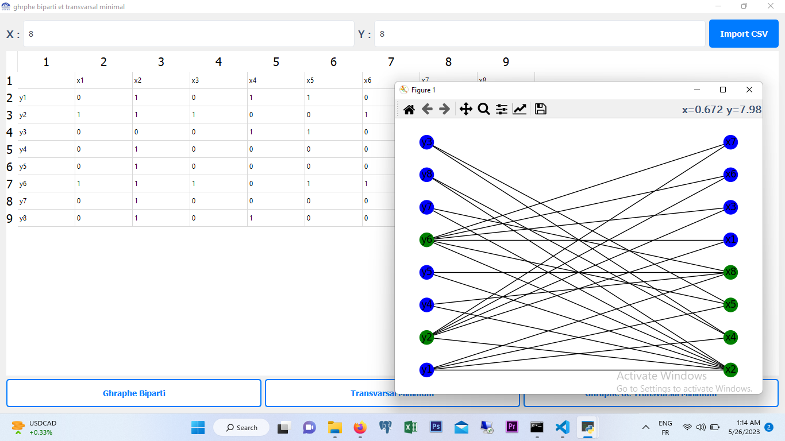

# biparti_transvarsal_minimal
The algorithm works by first finding a maximum matching in the bipartite graph, which is a set of edges that pairs as many nodes as possible without sharing any common nodes. Then, the maximum matching is converted into a vertex cover, which is a set of nodes that covers all the edges in the graph. Since the vertex cover alternates between the sets X and Y, it represents the minimum number of nodes required to cover all the edges in the graph.

## Environment

1. Install virtualenv:
```
pip install virtualenv
```
2. Create a virtual environment:
```
python -m  virtualenv env
```

3. Activate the virtual environment:
- On Windows:
  ```
  env\Scripts\activate
  ```
- On macOS and Linux:
  ```
  source env/bin/activate
  ```
## Installation

Install the required packages:
```
pip install -r requirements.txt
```
## Execution

Run the main script:
```
python main.py
```
## Build

Build the project:
```
python setup.py
```
## Installation File
Click [here](https://drive.google.com/drive/folders/15tkfofVFKI3tjrjyWhQUSh4uVjxwZ0-R?usp=share_link) to download the installation file.


